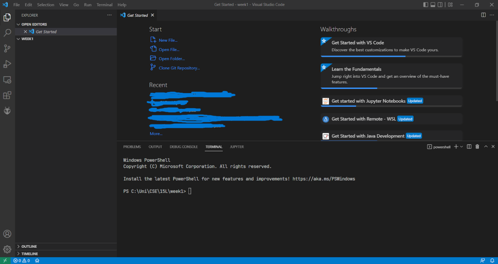
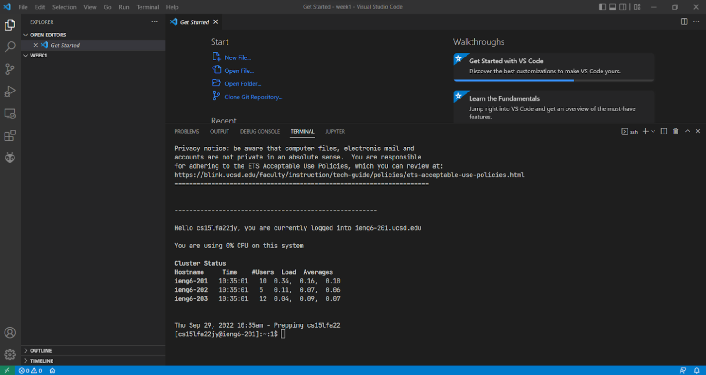
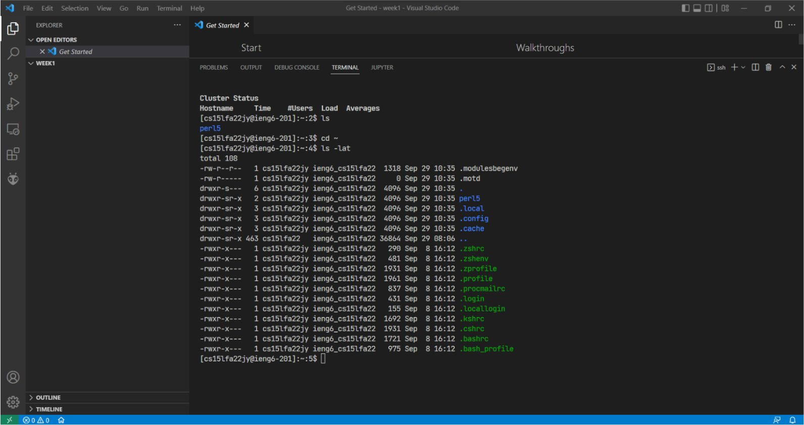
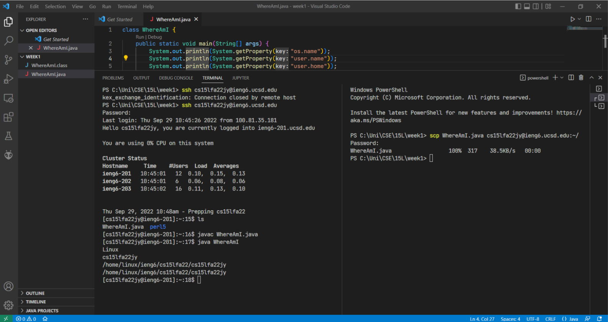
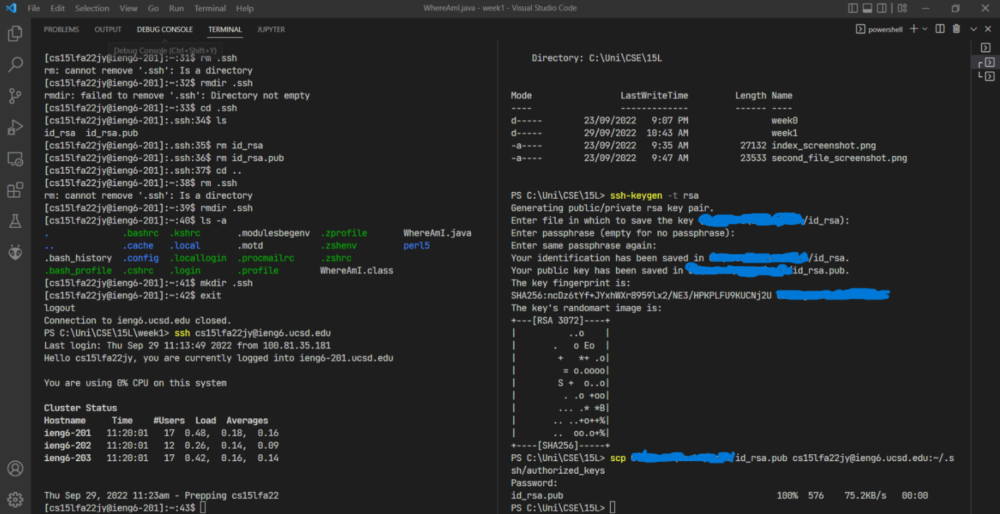
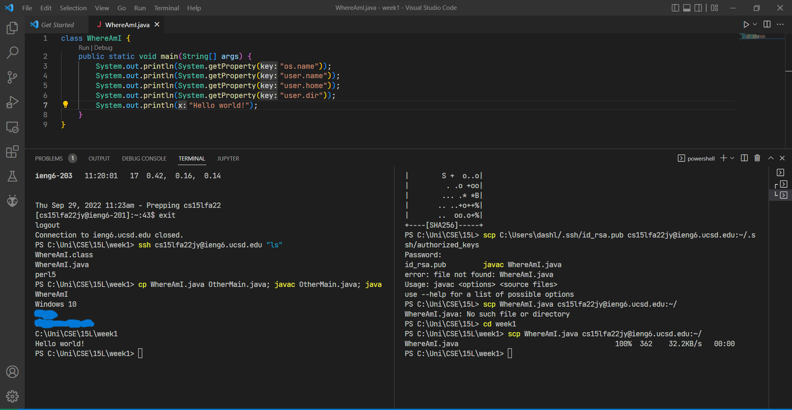

# Week 1 Lab Report
Author: Trung Dat Luu.<br>
This lab report is intended for Windows users only since there are additional steps required for the Windows operating system.
## Purpose of the lab
### Definitions
* **Server**: a set of machines hosted remotely that are used for various purposes such as clustering, accessing resources including computing power, storage, etc.
* **Client**: a local machine that attempts to connect to the server.
### Goal
The goal of this lab is to show the user how to connect to a remote server and perform numerous tasks on that server using the command line interface.
## Installing VSCode
* To install VSCode, go to [VSCode](https://code.visualstudio.com/) and download a stable version of VSCode that works on the machine's operating system, in this case, it is Windows.<br>
* After following the instructions from the installer, the user should open VSCode and see a user interface somewhat similar to the one below.


## Remotely connecting
* To remotely connect to a server, the user needs to ensure that [OpenSSH](https://learn.microsoft.com/en-us/windows-server/administration/openssh/openssh_install_firstuse?tabs=gui) has been installed locally.
* If everything works, use the `ssh` command to access the server: `ssh <username>@<servername>`. In this case, the command is
```
ssh cs15lfa22zz@ieng6.ucsd.edu
```
where `zz` is replaced by the last two characters of the account's username.
* Type `yes` if this is the first time the user connects to the server.
* The user should see some output from the terminal similar to the screenshot below.


## Trying some commands
After a successful login, user can try different commands on the server, some of which include:
* `cd <directory>`: change directory.
* `ls`: list files in the current directory.
* `pwd`: print the current directory.
* `cat <file>`: print the content of a file.
* `exit`: log out of the server.


## Moving files with scp
The following steps demonstrates how to copy a file from a local machine to the server.
* Create a Java file named WhereAmI.java.
* Copy the following block of code and paste it into the file.
```
class WhereAmI {
  public static void main(String[] args) {
    System.out.println(System.getProperty("os.name"));
    System.out.println(System.getProperty("user.name"));
    System.out.println(System.getProperty("user.home"));
    System.out.println(System.getProperty("user.dir"));
  }
}
```
* Try running the program by typing these two commands:
```
javac WhereAmI.java
java WhereAmI
```
* To copy the file to the remote server, use the `scp` command with the syntax
```
scp <file> <username>@<servername>:<path>
```
where file is the file to be copied and path is the file path to store the file on the server. In this case, the command becomes
```
scp WhereAmI.java cs15lfa22zz@ieng6.ucsd.edu:~/
```
where ~ represents the home directory on the server.
* Type in the password and the file will be copied.


## Setting an SSH key
Taking advantage of SSH keys is a great way to avoid the pitfalls of using long and tedious passwords to log in. The following steps demonstrate how to generate and use SSH keys to access the server.
* Type `ssh-keygen -t rsa` to generate a pair of public and private key on the local machine.
* Specify the location to store the two files (one for private key with no extension, one for public key with **.pub** extension).
* Log into the server, create a directory using the `mkdir .ssh` command, and log out of the server with `exit`.
* Use `scp` command to copy the public key, that is, the file with the **.pub** extension, to the **.ssh** directory created on the server. The user might type his or her password one more time.
* Try logging into the server with `ssh`. This time, it should not ask the user for password like the screenshot below.


## Optimizing remote running
* The user can try the following command.
```
ssh cs15lfa22zz@ieng6.ucsd.edu "ls"
```
which accesses the remote server and list the files in its home directory (remember to replace `zz` with the last two characters in the username).
* The user can also execute multiple commands on one run and separate them with semicolon ";".
```
cp WhereAmI.java OtherMain.java; javac OtherMain.java; java WhereAmI
```
This line simple copies the content of **WhereAmI.java** to **OtherMain.java**, which is a new file, compiles **OtherMain.java** and runs the bytecode stored in **WhereAmI.class**.
* We can also use the arrow up key to access previous commands rather than retype them.

