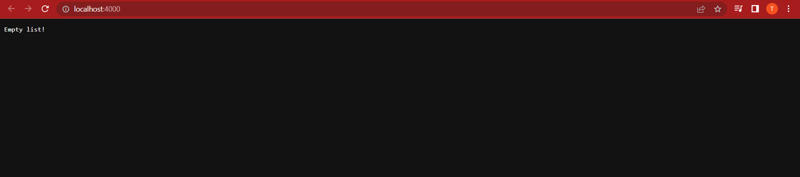
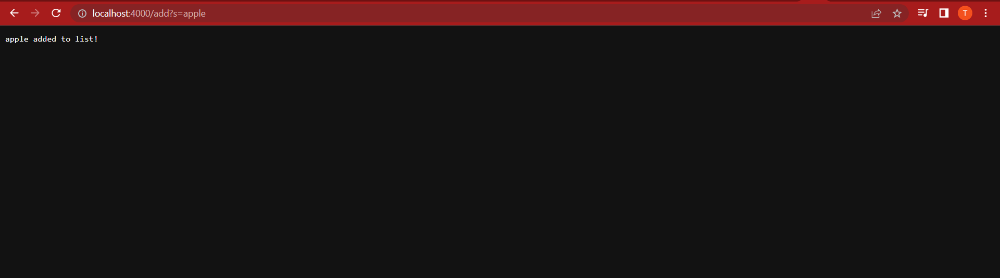
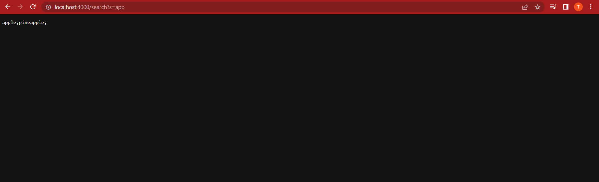
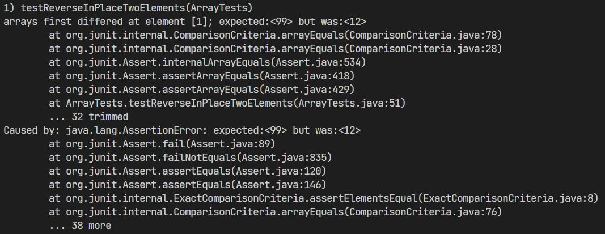
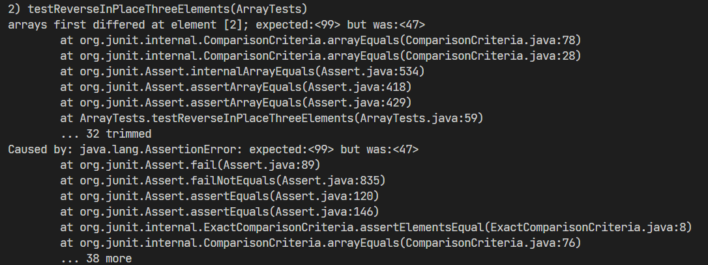
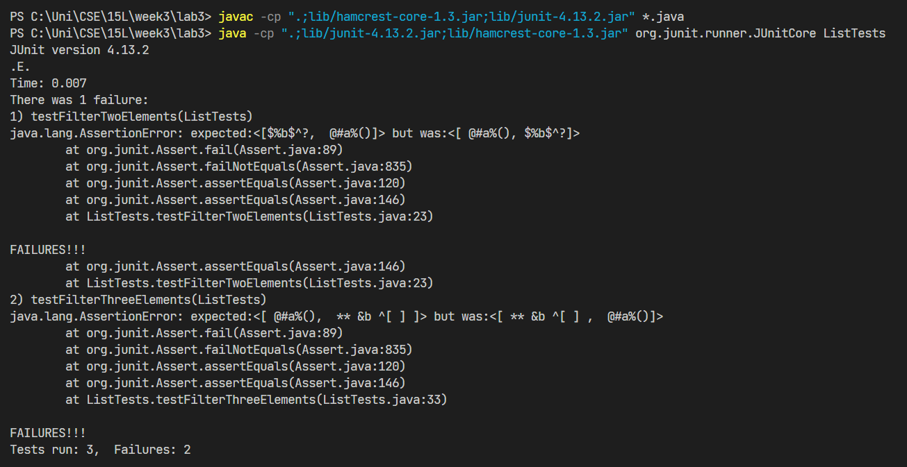

# Week 3 Lab Report
Author: Trung Dat Luu.<br>
## Part 1
### Code for Simplest Seach Engine
The following is the code for `Simplest Search Engine` from week 2:
```
import java.net.URI;
import java.util.ArrayList;
import java.io.IOException;

class SearchEngineHandler implements URLHandler {
    private ArrayList<String> strLists;

    public SearchEngineHandler() {
        strLists = new ArrayList<>();
    }

    public String handleRequest(URI url) {
        String path = url.getPath();
        String[] parameters;

        if (path.equals("/")) {
            if (strLists.isEmpty()) {
                return "Empty list!";
            }
            String responseBody = "";
            for (String str : strLists) {
                responseBody += str + ";";
            }
            return responseBody;
        } else if (path.indexOf("/add") == 0) {
            parameters = url.getQuery().split("=");
            if (parameters[0].equals("s")) {
                strLists.add(parameters[1]);
                return String.format("%s added to list!", parameters[1]);
            }
        } else if (path.indexOf("/search") == 0) {
            parameters = url.getQuery().split("=");
            if (parameters[0].equals("s")) {
                String responseBody = "";
                for (String str : strLists) {
                    if (str.contains(parameters[1])) {
                        responseBody += str + ";";
                    }
                }
                return responseBody;
            }
        }
        
        return "404 not found!";
    }
}

class SearchEngine {
    public static void main(String[] args) throws IOException {
        if(args.length == 0){
            System.out.println("Missing port number! Try any number between 1024 to 49151");
            return;
        }

        int port = Integer.parseInt(args[0]);

        Server.start(port, new SearchEngineHandler());
    }
}
```
### Index page
* The method `main` is called and the port number provided by the user in the command line is used as an argument, in this case, the port number is `4000`.
* A SearchEngineHandler object is created and passed to the static method `Server.start`.
* The `handleRequest` method is called and the server looks for a path matching that of the index page, which is `/`.
* Since the instance variable `strLists` is still empty, `handleRequest` returns the string `Empty list!` to be displayed in the body of the index page.



### Add request
* The `handleRequest` method is called and the server looks for a path that matches `/add`.
* The query string is then provided by the user using the syntax `?s=content`.
* Once the request is received by the server, it first splits `s=content` into two parts: one before `=`, which is `s` and one after `=`, which is `content`.
* The server then checks if the first part matches `s`. If it does, it then inserts `content` into `strLists` and returns some string to the client. Otherwise, `404 not found!` is returned.

In the two screenshots below, `apple` and `pineapple` are two pieces of input provided by the user. After the add operation executes, `strLists` now contains two strings `apple` and `pineapple`.




### Search request
* The `handleRequest` method is called and the server looks for a path that matches `/search`.
* The user provides the query string by typing in the syntax `?s=content`.
* Much like what happens with `Add`, the query string is split into two parts: one before `=`, which is `s` and one after `=`, which is `content`.
* The server then checks if the first part matches `s`. If it does, it then searches for strings that contain `content` as a substring, concatenates the result to a new string and returns the new string as the body of the page. Otherwise, the server simply returns `404 not found!`.

In the screenshot below, the user provides `app` as an input. After the search operation executes, the server returns any string in `strLists` that contains `app` as its substring. In this case, it is both `apple` and `pineapple`.


## Part 2
### ArrayTests
**Failure-inducing input**:
```
@Test
  public void testReverseInPlaceTwoElements() {
    int[] input1 = {99, 12};
    int[] output1 = {12, 99};
    ArrayExamples.reverseInPlace(input1);
    assertArrayEquals(output1, input1);
  }

  @Test
  public void testReverseInPlaceThreeElements() {
    int[] input1 = {99, 12, 47};
    int[] output1 = {47, 12, 99};
    ArrayExamples.reverseInPlace(input1);
    assertArrayEquals(output1, input1);
  }
```
**Symptom**:




**The bug**:
```
// Changes the input array to be in reversed order
  static void reverseInPlace(int[] arr) {
    for(int i = 0; i < arr.length; i += 1) {
      arr[i] = arr[arr.length - i - 1];
    }
  }
```
In both tests, the buggy code does not switch elements from both sides but instead, it assigns one element to another which causes the program to produce incorrect output. What the programmer should do is going through only the left half of the array and switch each element with its corresponding element in the right half.<br>
The following code should fix the issue:
```
// Changes the input array to be in reversed order
  static void reverseInPlace(int[] arr) {
    for(int i = 0; i < arr.length / 2; i += 1) {
      int temp = arr[i];
      arr[i] = arr[arr.length - i - 1];
      arr[arr.length - i - 1] = temp;
    }
  }
```
### ListTests
**Failure-inducing input**:
```
@Test
    public void testFilterTwoElements() {
        String[] arrInput1 = {"$%b$^?", " @#a%()"};
        List<String> input1 = new ArrayList<>(Arrays.asList(arrInput1));
        List<String> expected1 = new ArrayList<>(Arrays.asList(arrInput1));
        List<String> actual1 = ListExamples.filter(input1, new ContainsAlphanumeric());
        assertEquals(expected1, actual1);
    }

    @Test
    public void testFilterThreeElements() {
        String[] arrInput1 = {"$%$^?", " @#a%()", " ** &b ^[ ] "};
        String[] arrOutput1 = {" @#a%()", " ** &b ^[ ] "};
        List<String> input1 = new ArrayList<>(Arrays.asList(arrInput1));
        List<String> expected1 = new ArrayList<>(Arrays.asList(arrOutput1));
        List<String> actual1 = ListExamples.filter(input1, new ContainsAlphanumeric());
        assertEquals(expected1, actual1);
    }
```
**Symptom**


**The bug**
```
interface StringChecker { boolean checkString(String s); }

// A class implementing the StringChecker interface
class ContainsAlphanumeric implements StringChecker {
  public boolean checkString(String s) {
    for(int i = 0; i < s.length(); ++i) {
      char c = s.charAt(i);
      if (Character.isAlphabetic(c) || Character.isDigit(c)) {
        return true;
      }
    }
    return false;
  }
}

// The buggy code:
// Returns a new list that has all the elements of the input list for which
  // the StringChecker returns true, and not the elements that return false, in
  // the same order they appeared in the input list;
  static List<String> filter(List<String> list, StringChecker sc) {
    List<String> result = new ArrayList<>();
    for(String s: list) {
      if(sc.checkString(s)) {
        result.add(0, s);
      }
    }
    return result;
  }
```
In the `filter` method above, the chosen element is not added to the end of the list but to the front, which means the output list does not have the same order as the input. One way to fix this issue is to remove the `0` in the call to `add` method.
```
// Returns a new list that has all the elements of the input list for which
  // the StringChecker returns true, and not the elements that return false, in
  // the same order they appeared in the input list;
  static List<String> filter(List<String> list, StringChecker sc) {
    List<String> result = new ArrayList<>();
    for(String s: list) {
      if(sc.checkString(s)) {
        result.add(s);
      }
    }
    return result;
  }
```