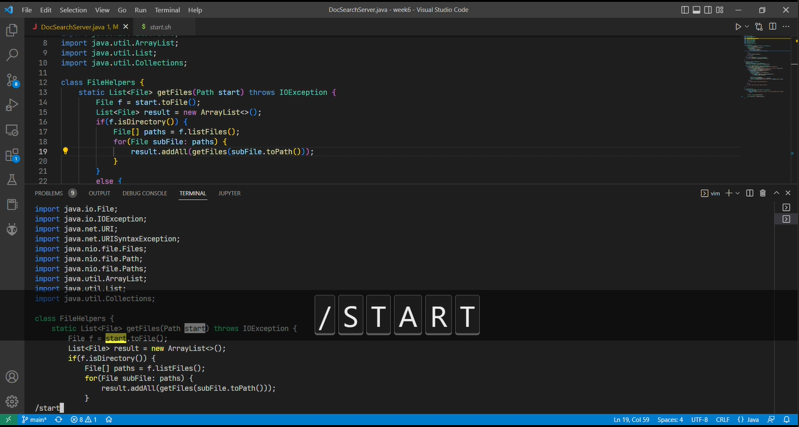
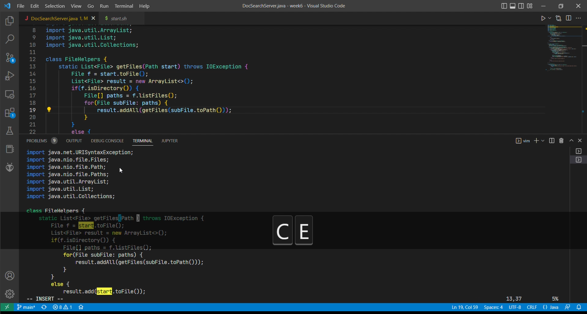
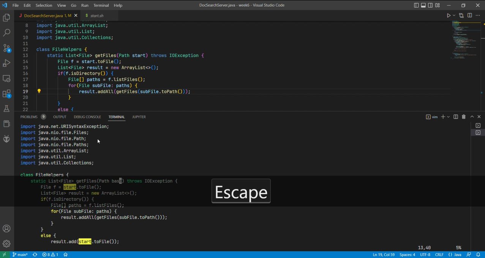
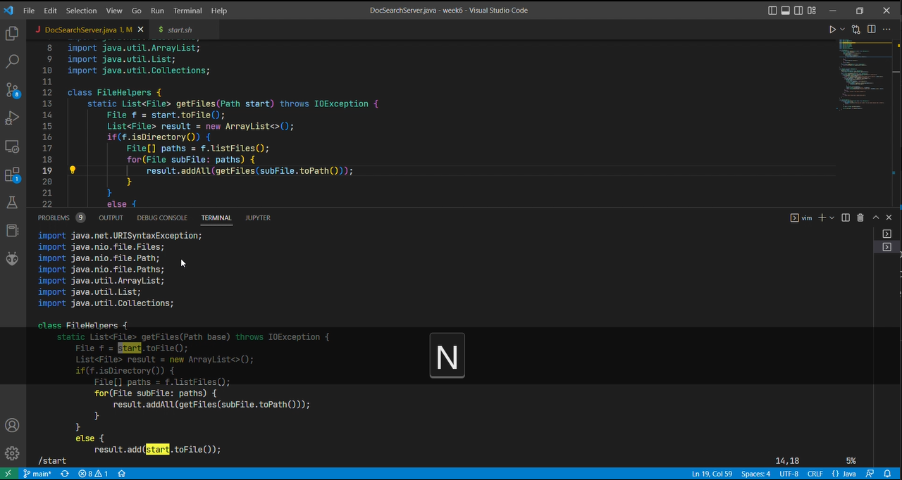
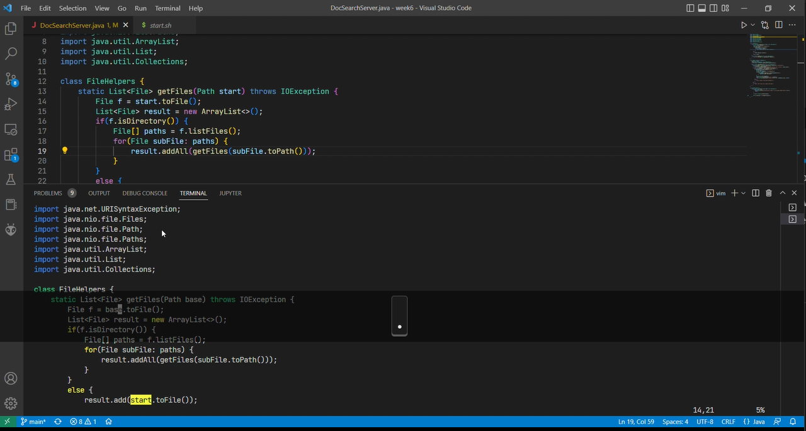
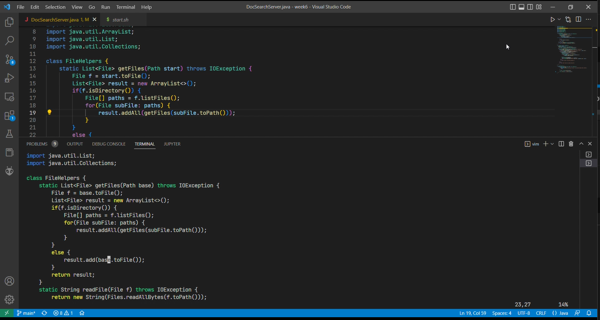
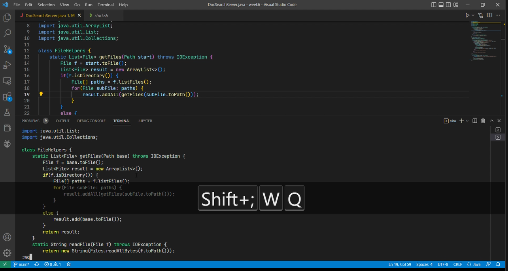

# Week 7 Lab Report
**Author**: Trung Dat Luu. 
## Part 1
Sequences of keys to change the name of the `start` parameter and its uses to `base`:

Press `< / >` in **normal** node to access vim's search function.
Type `start` by pressing `<s><t><a><r><t>`. Vim will jump to the first occurence of `start`.

Press `<c><e>` to erase the word `start`.

Type `base` by pressing `<b><a><s><e>`.

Press `<Escape>` to exit **insert** mode.

Press `<n>` to go to the next occurrence of `start`.

Press `<.>` to repeat the last command, which is replacing `start` with `base`.

Press `<n>` and `<.>` two more times to replace all occurrences of `start` to `base`.

Press `<:><w><q>` to save the changes and quit Vim.

## Part 2
### Part 2.1
**Report how long it took you to make the edit in seconds in both styles.** 
For the first way. which is editing on VSCode and `scp` my files to the remote server, I did in 11 seconds. 
For the second way, it took me a bit longer, about 16 seconds to edit file directly using Vim on the remote machine.
### Part 2.2
**Which of these two styles would you prefer using if you had to work on a program that you were running remotely, and why?** 
I would prefer to use Vim on the remote server rather than the local machine. The first reason is that after learning and practicing Vim, I see that it is much easier to make changes directly on the remote machine. The second reason is that there might be some incompatibilities between platforms when using `scp`. When I tried `scp` my file from my Windows laptop to the remote server, the bash script seems to be broken because of the `\r\n` character and that forced me to rewrite the whole script which was a waste of time.

**What about the project or task might factor into your decision one way or another? (If nothing would affect your decision, say so and why!)** 
One factor that might affect my decision is the size of the project. If the project requires constant iteration and rapid development, it is easier and more convenient to use the tools, compilers, and IDEs with smart code suggestions that might help me finish my tasks faster. Another factor is platform dependency. The project might have been built on code that works specifically well on one platform but not the other. For example, a C# project works better with Windows than MacOS, or an iOS project that theoretically only works well on macOS and can be tested effectively on iOS devices.
