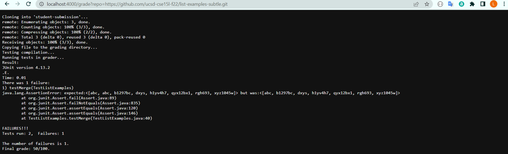
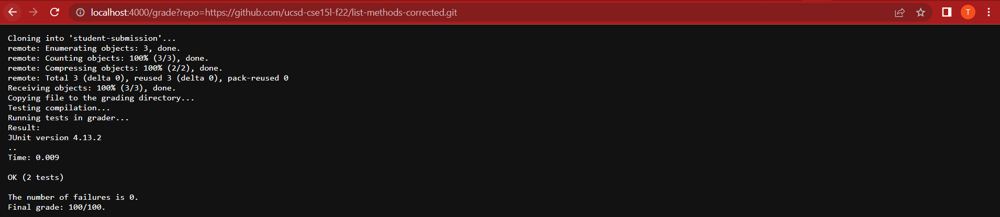
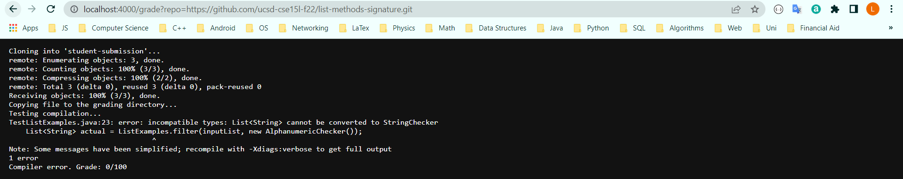

# Week 9 Lab Report
**Author**: Trung Dat Luu.<br>
## Part 1 - grade.sh code and screenshots
### Part 1.1 - grade.sh
```
set -e
rm -rf student-submission
git clone $1 student-submission
FILE=student-submission/ListExamples.java
echo "Copying file to the grading directory..."
set +e
cp $FILE .
if [ ! -f "$FILE" ]; then
	echo "File does not exist. Grade 0/100"
	exit 1
fi
CPATH=.:lib/hamcrest-core-1.3.jar:lib/junit-4.13.2.jar
echo "Testing compilation..."
javac -cp $CPATH *.java
if [[ $? -ne 0 ]]; then
	echo "Compiler error. Grade: 0/100"
	exit 2
fi
echo "Running tests in grader..."
echo "Result:"
java -cp $CPATH org.junit.runner.JUnitCore TestListExamples > output.txt
FAILURES=$(grep -w -o "E" output.txt | wc -l)
TOTAL=2
GRADE=$((100*($TOTAL-$FAILURES)/2))
cat output.txt
echo "The number of failures is $FAILURES."
echo "Final grade: $GRADE/100."
```
### Part 1.2 - Three screenshots of student submissions






## Part 2 - Tracing the script
The repository I chose for script tracing is [list example with subtle bugs](https://github.com/ucsd-cse15l-f22/list-examples-subtle.git)
```
set -e
rm -rf student-submission
```
For the two lines above, the output for the standard ouput and standard error is empty and the exit code is 0.
```
git clone $1 student-submission
```
For the line above, the exit code is 0, the output for the standard error is empty but the output for the standard output is:
```
Cloning into 'student-submission'...
remote: Enumerating objects: 3, done.
remote: Counting objects: 100% (3/3), done.
remote: Compressing objects: 100% (2/2), done.
remote: Total 3 (delta 0), reused 3 (delta 0), pack-reused 0
Receiving objects: 100% (3/3), done.
```
```
FILE=student-submission/ListExamples.java
```
The next line assigns the path to the java file to be graded to a bash variable. The output for the standard output and standard error is empty and the exit code is 0.
```
echo "Copying file to the grading directory..."
```
The next line prints out a message indicating that the graded file is being copied. The output for the standard error is empty and the output for the standard output in this case is `Copying file to the grading directory...` and the exit code is still 0.
```
if [[ $? -ne 0 ]]; then
	echo "Compiler error. Grade: 0/100"
	exit 2
fi
```
The if statement is used to check whether the file exists. Since it does, the if condition is false and the two commands inside the body are not executed so the output for the standard output and standard error is empty and the exit code is 0.
```
CPATH=.:lib/hamcrest-core-1.3.jar:lib/junit-4.13.2.jar
```
The line above assigns the class path for running the test cases against the graded file to a bash variable. The output for the standard output and standard error is empty and the exit code remains 0.
```
echo "Testing compilation..."
```
The next line prints out a message indicating the graded file is being compiled. The output for the standard error is empty but the output for the standard output is `Testing compilation...` and the exit code is 0.
```
javac -cp $CPATH *.java
```
This line executes Java code compilation to create class files. Since the compilation is successful, there should not be any output for the standard output and the standard error and the exit code should still be 0.
```
if [[ $? -ne 0 ]]; then
	echo "Compiler error. Grade: 0/100"
	exit 2
fi
```
Since the previous exit code is 0, the if condition is false and the two commands inside the body are not executed. The output for the standard output and standard error is thus empty and the exit code is 0.
```
echo "Running tests in grader..."
```
For the line above, the output for the standard output is `Running tests in grader...` while the standard error does not have any output and the exit code is 0.
```
echo "Result:"
```
For this line, the output for the standard output is `Running tests in grader...` while the standard error does not have any output and the exit code is still 0.
```
java -cp $CPATH org.junit.runner.JUnitCore TestListExamples > output.txt
```
This next line runs the program and directs its output to a file named `output.txt` so the output for the standard output and standard error is empty. However, since the program does not pass all tests, the exit code becomes 1.
```
FAILURES=$(grep -w -o "E" output.txt | wc -l)
TOTAL=2
GRADE=$((100*($TOTAL-$FAILURES)/2))
```
For the next three lines, the scripts tries to find the number of occurrences of `E` to calculate the final grade for the student submission. Since each line executes without any errors, the output for the standard output and the standard error is empty and the exit code is 0.
```
cat output.txt
```
This line prints out the content of output.txt. The exit code remains 0 and the output for the standard error is empty but that for the standard output is:
```
Time: 0.01
There was 1 failure:
1) testMerge(TestListExamples)
java.lang.AssertionError: expected:<[abc, abc, b1297bc, dxys, h1yv4h7, qyx12bx1, rgh693, xyz1045w]> but was:<[abc, b1297bc, dxys, h1yv4h7, qyx12bx1, rgh693, xyz1045w]>
        at org.junit.Assert.fail(Assert.java:89)        at org.junit.Assert.failNotEquals(Assert.java:835)
        at org.junit.Assert.assertEquals(Assert.java:120)
        at org.junit.Assert.assertEquals(Assert.java:146)
        at TestListExamples.testMerge(TestListExamples.java:40)

FAILURES!!!
Tests run: 2,  Failures: 1
```
```
echo "The number of failures is $FAILURES."
```
This line prints out the number of test failures. The exit code is still 0 and the standard error's output is empty. However, the output for the standard output is:
```
The number of failures is 1.
```
```
echo "Final grade: $GRADE/100."
```
The last line prints out the final grade for the student submission. The exit code is unchanged, which is 0, and the standard error's output is still empty. On the contrary, the content of the standard output is:
```
Final grade: 50/100.
```
